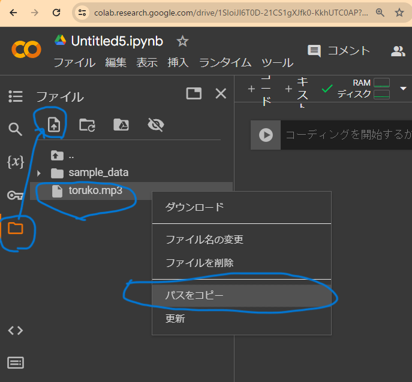
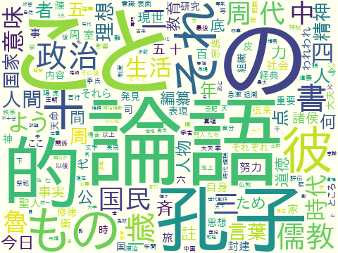

### Shibata　HighSchool　HandsOn
------

<center>

# 講義ノート (Alpha) <!-- omit in toc -->
## 新潟県立新発田高等学校 <!-- omit in toc -->
#### 研修名： 課題研究のための情報処理 <!-- omit in toc -->
#### 2024/2/19(火) 14:10-16:50 @ 新発田高等学校 <!-- omit in toc -->
#### 講師：　開志専門職大学　情報学部　堀川 桂太郎 <!-- omit in toc -->

</center>

-----
## 目次 <!-- omit in toc -->- [高校生の課題探求型学習に向けて](#高校生の課題探求型学習に向けて)
- [高校生の課題探求型学習に向けて](#高校生の課題探求型学習に向けて)
  - [課題探求型の重要性](#課題探求型の重要性)
  - [本研修の概要](#本研修の概要)
  - [獲得するスキル](#獲得するスキル)
  - [演習内容](#演習内容)
  - [事前準備](#事前準備)
  - [予習、自主トレ](#予習自主トレ)
  - [セッション0.  Pythonでクラシック音楽・動画再生](#セッション0--pythonでクラシック音楽動画再生)
  - [セッション1.  Colabで The Laughing Man](#セッション1--colabで-the-laughing-man)
  - [セッション2.  現在地の近傍地図](#セッション2--現在地の近傍地図)
  - [セッション3.  球の体積、モンテカルロ法](#セッション3--球の体積モンテカルロ法)
  - [セッション4.  Pythonで 3Dグラフ表示](#セッション4--pythonで-3dグラフ表示)
  - [セッション5.  WordCloud ワードクラウド](#セッション5--wordcloud-ワードクラウド)
  - [セッション6.  稀少データは自分で作る（MCMC）](#セッション6--稀少データは自分で作るmcmc)
  - [セッション7.  量子テレポーテーションって何？](#セッション7--量子テレポーテーションって何)
  - [セッション8.  最適化問題を物理法則で解いてもらう](#セッション8--最適化問題を物理法則で解いてもらう)

-----
<div style="page-break-before:always"></div>

# 高校生の課題探求型学習に向けて

## 課題探求型の重要性
### 現状に満足せず、妥協しない、成長と挑戦の源泉  <!-- omit in toc -->
- 問題解決、よりも、**問題発見**が難しい
- 金鉱採掘、よりも、**金脈発見**が難しい
- 仕事をこなす/探す、よりも、**雇用をつくる**ことが難しい

###  探求の効能  <!-- omit in toc -->
- **能動アウトプット型の自己成長**　：受動インプット型より，はるかに高い教育効果
- すべての若者達へ：　　**失敗を恐れず，挑戦する実行力**　
- 優れたアイディアを真似するのは簡単だが，**卓越した実行力**を模倣することは困難を極める（ルイス・ガースナー）
  
###  課題の探求方法 <!-- omit in toc -->
- 発明好きの発想
- 好奇心と観察
- 多様な視点,　異文化融合

###  課題探求に必要な資質 <!-- omit in toc -->
- 面白い！不思議！と思う感受性
- 困っている人を助ける視点
- 知らないことを知りたい、と思う知識欲
- 普通と違うユニークな視点を受容する広い視野、寛容性

-----
<div style="page-break-before:always"></div>

## 本研修の概要

- 2024年度 **総合的な探求の時間**に役立つ情報処理プラクティス
- 2025年共通テストに、**情報Ⅰ**が追加される背景事情
- データ分析、実践的Pythonプログラミング～初級中級ハンズオン～
- 生成AIを副操縦士としたプログラミング
- インターネット接続されたPC、Webブラウザの対話作業
- 高校生の探究活動へ展開・応用

## 目的：本日お持ち帰りいただきたいスキル
- 「こんなことできるのかな？」　⇒　「**やればできる**」を実感する
- 目的・要件⇒デザイン　⇒　PoC確認まで30分
- ちょこっとPython: スキマ時間に簡単お手軽プログラミング 
- Holiday Coding:　家族に自慢できるPython使い

-----
<div style="page-break-before:always"></div>

## 演習内容
- Google Colaboratory、Microsoft Bing AI Copilotを使います
- 参加者の皆様のペース配分を見ながら
- 1セッション30分程度でハンズオン × 3～4セッション行います
- 1セッション30分でコーディング＆動作確認まで実施します
- Python初心者はペアプログラミング等follow体制を考えます
- カスタマイズやアレンジは後日、家から実施可能です
- 下記はイメージですが、リストから適宜、ピックアップして演習します

||学習項目|概要、方法|ハンズオン|
|-|-|-|:-:|
|0|Pythonでクラシック音楽、動画再生|クラウド環境でPython実行しWebで音楽・動画再生||
|1|姿勢推定／顔の中心位置検出|Colabで **The Laughing Man2024/02**|3|
|2|地図と現在地|現在地点の拡大縮小可能な地図を表示|1|
|3|3D表現|3D空間にランダムな点描画で球を表現、球の体積を試算<br>3Dプリンタの積層方式で図形を立体化||
|4|WordCloud|（国語、英語の先生方向け）<br>テキストで頻出する単語を視覚表現|2|
|5|データ分析・データ生成|生成AIに訊く：創造主は確率でデータを創造する?|4|
|6|量子ゲート|量子テレポーテーションって何？||
|7|最適化問題の量子的求解|8-Queen||

-----
<div style="page-break-before:always"></div>

## 事前準備

||項目|作業|チェック|
|:-:|-|-|:-:|
|0|Googleアカウント取得|gmailサインアップ・サインイン|✓|
|1|Microsoftアカウント取得|Windows10 ログイン|✓|
|2|WebブラウザEdge起動|ブラウザ画面を4つほど利用予定|✓|
|3|Google Colaboratoryログイン|https://colab.research.google.com/?hl=ja|✓|
|4|新規ノートブック作成|基本操作を試す|✓|
|5|Microsoft Bing AI画面表示|Copilotに質問、基本操作を試す|✓|
|6|基本動作確認 | 講義用notebookファイルをDownloadして試す (https://github.com/keythrive/SHSH/tree/main/notebooks)|✓|
|7|Pythonパッケージの事前インストール|（Colaboratoryで実行いただくPythonパッケージの事前インストール設定作業）|✓|

- 演習のチョイスによりますが、下記を事前に実行済状態であればスムーズに演習に入れると思います
- 下記URLからJupyterファイルをダウンロード:

  　　https://github.com/keythrive/SHSH/tree/main/notebooks

- Colaboratoryで実行いただくPythonパッケージの事前インストール設定作業：

```
!pip install geopy folium plotly
!pip install xmltodict 

!apt install aptitude
!aptitude install git make curl xz-utils file -y
!aptitude install mecab libmecab-dev mecab-ipadic-utf8 -y
!apt-get -y install fonts-ipafont-gothic
!pip3 install mecab-python3==0.7
```

## 予習、自主トレ
- 必要に応じてPython学習環境,たとえばPyWeb集合学習、チュートリアルなど、  https://pyweb.ayax.jp/PyWeb.html#pywebver

- 事前にざっと目を通し、予習やお試しを進めておくとよいでしょう

-----
<div style="page-break-before:always"></div>

## セッション0.  Pythonでクラシック音楽・動画再生

    【実施すること】 
    　・クラウド環境でPythonプログラムを作成し実行 
    　・PCのWebブラウザでクラシック音楽が再生

1.   クラシック音楽ファイルを用意する：
  (例)  著作権フリーのクラシック音楽サイト: 
    - https://mmt38.info/arrange/morzalt/
    - モーツァルト「トルコ行進曲」をダウンロード
    - toruko.mp3 ⇒　Downloadフォルダへ
2.  Colaboratoryにログイン
3.  新規ノートブック作成
  
4.  音楽ファイルをアップロード
  
5.  コードセル追加
6.  下記コードを入力、楽曲ファイルのpath  (/content/toruko.mp3)を取得、設定
    

```Python
import IPython
music_path = '/content/toruko.mp3'
print(f'楽曲ファイル:{music_path}')
IPython.display.Audio(music_path)
```
7. セル横の再生ボタンで、実行する
    
8. アレンジ：他の楽曲に変え、自由に楽しむ

------
```
    【実施すること】
    　・クラウド環境でPythonプログラムを作成し実行 
    　・PCのWebブラウザで動画再生
```

0.   動画ファイルを用意する：
  (例)  著作権フリーでダウンロード可能な動画ファイル: 
    - https://pixabay.com/ja/videos/
    - 銀河系の動画をダウンロード　https://pixabay.com/ja/videos/%E9%8A%80%E6%B2%B3-%E8%9E%BA%E6%97%8B-%E7%84%A1%E9%99%90%E3%83%AB%E3%83%BC%E3%83%97-%E3%83%AB%E3%83%BC%E3%83%97-107129/
1.  Colaboratoryにログイン
2.  セッション1の続きで、新規セルの追加
3.  動画ファイルをアップロード
4.  動画ファイルのpath  (/content/galaxy.mp3)を取得、設定
5.  下記のコードを入力し、

```Python
import io, base64
from IPython.display import HTML
from google.colab import drive

def show_local_mp4_video(file_name, width=320, height=240):
  video_encoded = base64.b64encode(io.open(file_name, 'rb').read()) 
  return HTML(data='''
    <video width="{0}" height="{1}" alt="test" controls>
        <source src="data:video/mp4;base64,{2}" type="video/mp4" />
    </video>'''.format(width, height, video_encoded.decode('ascii'))) 

# drive.mount('/content/gdrive', force_remount=True)
movie = 'galaxy'
video_path = f'/content/{movie}.mp4'
show_local_mp4_video(video_path)
```
6. セル横の再生ボタンで、実行する
    
7. アレンジ：　他の動画に差し変えていろいろ楽しむ


-----
<div style="page-break-before:always"></div>

## セッション1.  Colabで The Laughing Man

    【実施すること】　深層機械学習（ディープラーニング）
    　・Webカメラ動画から、人の姿勢推定し顔の中心（鼻）を位置検出

　　デモ実演： Colabで **The Laughing Man2024/02**
  
    2024/2　The Laughing Man (笑い男事件発生)
    https://thelaughingman2024.jp/

```python
import requests
from IPython.display import HTML, display
from google.colab import files

html = '''
<!DOCTYPE HTML>
<html><head>
  <meta charset="UTF-8">
  <title>PoseNet example using p5.js</title>
  <script src="https://cdnjs.cloudflare.com/ajax/libs/p5.js/1.3.1/p5.min.js" crossorigin=""></script>
  <script src="https://cdnjs.cloudflare.com/ajax/libs/p5.js/1.3.1/addons/p5.dom.min.js" crossorigin=""></script>
  <script src="https://unpkg.com/ml5@latest" type="text/javascript" crossorigin=""></script>

</head>
<body>
  <h2>2024/2　The Laughing Man 事件発生</h2>
  <hr>
  <!-- <p id="status">Loading model...</p>
       <button onclick="setup()">起動</button>  -->
<script>
let video;
let poseNet;
let poses = [];
let icon;
let iconSize = 120;

function setup() {
  createCanvas(480, 360);

  video = createCapture(VIDEO);
  video.size(width, height);
 　　// url = "https://thelaughingman2024.jp/assets/img/img_mark_04.gif";
  url = "./img_mark_04.gif";

  icon = loadImage(url);
  poseNet = ml5.poseNet(video, modelReady);
  poseNet.on('pose', function(results) {
    poses = results;
  });

  video.hide();
}

function modelReady() {
}

function drawIcon() {
  for (let i = 0; i < poses.length; i++) {
    let pose = poses[i].pose;
    let nose = pose.keypoints[0];
    if (nose.score > 0.2) {
      let x = nose.position.x;
      let y = nose.position.y;
      let ix = x - iconSize / 2;
      let iy = y - iconSize / 2;
      ix = constrain(ix, 0, width - iconSize);
      iy = constrain(iy, 0, height - iconSize);
      image(icon, ix, iy, iconSize, iconSize);
    }
  }
}

function draw() {
  image(video, 0, 0, width, height);
  drawIcon();
}

</script>
</body></html>
'''
# display(HTML(html))

with open('index.html', 'w') as f:
  f.write(html)
files.download('index.html')

url = "https://thelaughingman2024.jp/assets/img/img_mark_04.gif";
response = requests.get(url)
save_name = "img_mark_04.gif"
file = open(save_name, "wb")

for chunk in response.iter_content(100000):
    file.write(chunk)
file.close()
files.download(save_name)

port,path = 8000,''
```

```
!nohup python3 -m http.server $port > server.log 2>&1 &

google.colab.output.serve_kernel_port_as_iframe(port, path=path)
```


-----
<div style="page-break-before:always"></div>

## セッション2.  現在地の近傍地図
    【実施すること】　クラウド環境Pythonプログラムを実行し、
     - Webブラウザ上に、現在地近傍の地図を表示
     - 拡大縮小可能な地図で簡単な道案内、ナビに利用できる
     - 住所から緯度経度の取得に失敗する場合、予めWebサイトで緯度経度を求めておく

1. 地図表示に必要なPythonパッケージをインストール
   
``` !pip install geopy folium xmltodict ```

2.  下記のコードを入力して実行

```python
import requests
import xmltodict
import folium

GeospatialUrl = "http://geocode.csis.u-tokyo.ac.jp/cgi-bin/simple_geocode.cgi?output=json&addr="

def address2geo(address):
  lat,lng = 0,0
  s_quote = requests.utils.quote(address)
  response = requests.get(GeospatialUrl + s_quote)
  if response.status_code == 200:
     json_data = xmltodict.parse(response.text)
     data = dict(json_data)
     result = data['results']
     lat = result["candidate"]['latitude']
     lng = result["candidate"]['longitude']
  else:
     print(f"Error: {response.status_code}")
  return lat,lng

def test_map(scale=10):
  niigata = [37.916192,139.036413]
  address_list = ["新潟県新潟市中央区米山3-1-53", "新潟県新発田市豊町3丁目7-6"]

  for a in address_list:
     map = folium.Map(location=niigata, zoom_start=scale)
     lat,lng = address2geo(a)
     folium.Marker([lat,lng], popup=a).add_to(map)
  return map

test_map(11)
```


-----
<div style="page-break-before:always"></div>

## セッション3.  球の体積、モンテカルロ法

    【実施すること】
    　- 3D空間にランダムな点描画で球を表現
    　- 球の中に入る確率計算で，　球の体積を見積もる　
    　- モンテカルロ法の意義を確認
    - 確率分布に従うデータ生成へ

球の体積の公式：　　
$V = \frac{4}{3} \pi  r^3$　
（r=1 半径１の理論値 V=4.1887902047863905）

```python
import math
4 * math.pi / 3　 # 理論値:4.1887902047863905
```

1.  下記コード入力して，実行　　（視点は固定）
   
```python
import numpy as np
import matplotlib.pyplot as plt
from mpl_toolkits.mplot3d import Axes3D

r,n = 1,10000

x = np.random.uniform(-r, r, n) 
y = np.random.uniform(-r, r, n) 
z = np.random.uniform(-r, r, n) 
d = np.sqrt(x**2 + y**2 + z**2) 
inside = d < r   # 単位球の内部か否か

volume = 8 * np.sum(inside) / n 
print(f"球の体積の近似値：{volume:.4f}") # 球の体積の近似値：4.2552

fig = plt.figure(figsize=(7, 7)) 
ax = fig.add_subplot(111, projection="3d") 
ax.scatter(x, y, z, c=inside, cmap="coolwarm", alpha=0.5) 

ax.set_title(f"Monte Carlo method for sphere volume (n={n})") 
ax.set_box_aspect((1, 1, 1)) 
plt.show() 
```


2. グラフィクスを plotlyに変更　（視点をマウス操作で自由に変えられる）

```python
import numpy as np
import plotly.express as px

r,n = 1,10000

x = np.random.uniform(-r, r, n) 
y = np.random.uniform(-r, r, n) 
z = np.random.uniform(-r, r, n) 
d = np.sqrt(x**2 + y**2 + z**2) 
inside = d < r 

volume = 8 * np.sum(inside) / n 
print(f"球の体積の近似値：　{volume:.4f}")

fig = px.scatter_3d(x=x, y=y, z=z, color=inside, color_continuous_scale=["lightblue", "darkblue"], opacity=0.5) 
fig.update_layout(title=f"Monte Carlo method for sphere volume (n={n})", scene=dict(xaxis_title="x", yaxis_title="y", zaxis_title="z"))
fig.show() 
```
```
   モンテカルロ法試算結果：　球の体積の近似値：4.1912
```


-----
<div style="page-break-before:always"></div>

## セッション4.  Pythonで 3Dグラフ表示
    【実施すること】
    - 　3Dプリンタの積層方式で図形を立体化  (視点固定)
    - 　3Dプリンタの積層方式で図形を立体化  (視点変更可能)

```python
import numpy as np
import matplotlib.pyplot as plt

t = np.linspace(0, 2 * np.pi, 100)
x = 16 * np.sin(t) ** 3
y = 13 * np.cos(t) - 5 * np.cos(2 * t) - 2 * np.cos(3 * t) - np.cos(4 * t)

fig = plt.figure()
ax = fig.add_subplot(projection='3d')
ax.set_title('Heart Curve 3D')

# Z軸方向に曲線を積層: 3Dプリンタ方式　　（視点は固定）
for z in range(11):
    # 金色からセピア色に変化
    r = 1 - 0.24 * z / 10
    g = 0.84 - 0.15 * z / 10
    b = 0 + 0.56 * z / 10
    # 線の色をグラデーションにする
    ax.plot(x, y, z, linewidth=16, color=(r, g, b))

plt.show()
```


-----

```python
import numpy as np
import plotly.graph_objects as go
t = np.linspace(0, 2 * np.pi, 100)
x = 16 * np.sin(t) ** 3
y = 13 * np.cos(t) - 5 * np.cos(2 * t) - 2 * np.cos(3 * t) - np.cos(4 * t)

fig = go.Figure()
fig.update_layout(title='Heart Curve 3D', scene=dict(xaxis_title='X', yaxis_title='Y', zaxis_title='Z'))

# Z軸方向に曲線を積層: 3Dプリンタ方式　（視点変更可能）
for z in range(30):
    fig.add_trace(go.Scatter3d(x=x, y=y, z=[z] * len(x), mode='lines', line=dict(colorscale=[[0, 'green'], [0.5, 'red'], [1.0, 'rgb(0, 0, 255)']], cmin=0, cmax=10,width=5)))
    x = x * 0.91 
    y = y * 0.91
fig.show()
```


-----
<div style="page-break-before:always"></div>

## セッション5.  WordCloud ワードクラウド
    【実施すること】 小説などテキストで頻出する単語を視覚表現
     - 例えば，源氏物語、枕草子、三国志、現代訳論語...
     - どんなキーワードがどれくらいの数で登場するか？
     - 視覚的に表現し，鑑賞して楽しむ

#### 源氏物語 <!-- omit in toc -->


#### 枕草子 <!-- omit in toc -->


#### 三国志 <!-- omit in toc -->


#### 現代訳論語<!-- omit in toc -->


- 事前準備、各種パッケージや日本語フォントのインストール
- （約１分ほどかかります）
  
```
!apt install aptitude

!aptitude install git make curl xz-utils file -y
!aptitude install mecab libmecab-dev mecab-ipadic-utf8 -y
!apt-get -y install fonts-ipafont-gothic
!pip3 install mecab-python3==0.7
```

```python
import os.path
import glob
import re
import pandas as pd
import zipfile
import urllib.request
import IPython
from IPython.display import Image, display
from sklearn.feature_extraction.text import TfidfVectorizer
from wordcloud import WordCloud
import MeCab

fpath = '/usr/share/fonts/opentype/ipafont-gothic/ipagp.ttf'
wc = WordCloud(background_color='ivory',width=480,height=360,font_path=fpath)

def download(URL):
    zip_file = re.split(r'/', URL)[-1]
    urllib.request.urlretrieve(URL, zip_file)
    dir = os.path.splitext(zip_file)[0]
    with zipfile.ZipFile(zip_file) as zip_object:
        zip_object.extractall(dir)
    os.remove(zip_file)
    path = os.path.join(dir,'*.txt')
    list = glob.glob(path)
    return list[0]

def convert(download_text):
    data = open(download_text, 'rb').read()
    text = data.decode('shift_jis')
    text = re.split(r'\-{5,}', text)[2]
    text = re.split(r'底本：', text)[0]
    text = re.split(r'［＃改ページ］', text)[0]
    text = re.sub(r'《.+?》', '', text)
    text = re.sub(r'［＃.+?］', '', text)
    text = re.sub(r'｜', '', text)
    text = re.sub(r'\r\n', '', text)
    text = re.sub(r'\u3000', '', text)
    text = re.sub(r'「', '', text)
    text = re.sub(r'」', '', text)
    text = re.sub(r'、', '', text)
    text = re.sub(r'。', '', text)
    return text

def extract(text):
    words = []
    tagger = MeCab.Tagger('-Ochasen')
    tagger.parse('')
    node = tagger.parseToNode(text)
    while node:
        if node.feature.split(',')[0] == u'名詞':
            words.append(node.surface)
        node = node.next
    text_result = ' '.join(words)
    return text_result

def tfidf_fig(title,url):
    download_file = download(url)
    text = convert(download_file)
    text = extract(text)

    wc.generate(text)
    fig = f'wc-{title}.png'
    wc.to_file(fig)
    # IPython.display.Image(fig)
    
    vectorizer = TfidfVectorizer()
    X = vectorizer.fit_transform([text])
    values = X.toarray()
    feature_names = vectorizer.get_feature_names_out()
    df = pd.DataFrame(values, columns = feature_names, index=[title])
    for i in df.index:
       print(df.loc[i].sort_values(ascending=False).head(20))
    display(df.head())

    return fig

# 青空文庫のタイトル、ファイルURL　（追加可能です）
Books = {
    '源氏物語' : 'https://www.aozora.gr.jp/cards/000052/files/5016_ruby_9746.zip',
    '三国志' : 'https://www.aozora.gr.jp/cards/001562/files/52409_ruby_51058.zip',
    '現代訳論語' : 'https://www.aozora.gr.jp/cards/001097/files/43785_ruby_58793.zip',
    '吾輩は猫である' : 'https://www.aozora.gr.jp/cards/000148/files/789_ruby_5639.zip',
    '三四郎' : 'https://www.aozora.gr.jp/cards/000148/files/794_ruby_4237.zip',
    'こころ' : 'https://www.aozora.gr.jp/cards/000148/files/773_ruby_5968.zip',
}

def main():
  images = []
  for k,v in Books.items():
    images += [(k,tfidf_fig(k,v))]

  for fig in images:
    print(fig[0])
    display(Image(fig[1]))

main()
```


-----
<div style="page-break-before:always"></div>

## セッション6.  稀少データは自分で作る（MCMC）

- データがなければ、データ分析は始まらない
- 稀少データは、集めることさえ難しい
- エントロピーに逆行し、創生されるデータには偏りがある
- 神（創造主）のみぞしる確率分布
- 集めることが難しいデータは、神頼みのサンプリング
- 生成AIに訊いてみる
- BAD: 生成AIに，データを作ってもらう
- GOOD: 生成AIに，データの作り方(考え方)を教えてもらう

    【実施すること】
    - 創造主の視点で，高校2年生の英語のテストの成績分布のルールを決める
    - 創造主の視点で，ルールに基づき，得点データを生成する
    - その方法を，生成AIに質問する
    - 生成AIが作成したPythonコードを実行し，適切な得点データがサンプリングできたか確認する
    - 180度視点を変えて，与えられた得点データを受けとる
    - 得点データの背景にある，神のみぞ知るルールを推定する
    - ベイズ推定により，神のルールを当てに行く
    - 推定された分布が，神のルールをどれくらい近似しているか確認する

##### 創造主の視点：　英語の成績データを作る


##### 生成AIに質問して，Pythonコードとその意味を学ぶ

-　生成AIへの質問文例（プロンプト）
```
高校２年生の英語の成績分布をマルコフ連鎖モンテカルロ法でランダムサンプリング生成したいです．
ここでは，２つの正規分布が重なっていると仮定します．
一つは平均55点で分散7点，もう一つは平均75点分散4点と仮定します．
120名の学生の英語の成績分布を作成して，グラフ可視化するPythonコードを教えて下さい．
```

- 生成AIに繰り返し質問しても，良い回答が得られない場合：
    - 生成AIは優秀なアシスタントでありえますが，万能ではありません
    - ピント外れの回答も，堂々巡りも，ハルシネーション（幻覚と言われる「事実にもとづかない情報，実在しない情報を生成する現象」）も少なからずあります
    - 生成AIへの依存・盲信(鵜呑み)は要注意，というより厳禁です
    - 自分の頭で考えて，判断することが軸足です
    - あくまでも自分自身がプレイヤーであり，
    - ゴルフの名キャディのように，良いヒントやアドバイスを提供してくれる心強いアシスタント
    - と捉えれば，ヒントやアドバイスを，判断材料としてしっかり消化吸収して
    - 有限の時間，プレイに最大集中することです
    - 生成AIのアドバイスに限界を感じる前に，
    - 速やかに自分自身で考えて，問題解決に全集中しましょう

##### 人間の視点：　英語の成績データから，神のみぞ知るルールを推定する


####  「神のみぞ知る」ルールを推定した結果
-  1つ目の正規分布は，(平均 $\mu_0$, 分散 $\sigma_0$) == (74.668,4.3) 
-  もう一つの正規分布は，(平均 $\mu_1$, 分散 $\sigma_1$) == (53.844,6.5) と推定された．
- 神モードで，生成AIに依頼した設定を確認：
```python
# 正規分布のパラメータを設定
mu1 = 55 # 平均
sigma1 = 7 # 分散
mu2 = 75 # 平均
sigma2 = 4 # 分散
```
- 一連の往復体験が何を意味するか？
- 演繹： すでに知られたルールがあって，そのルールに従うデータ（具体例）を作る
- 帰納的推論:  観察された事実（データ）から，その背景にある一般ルールを推定する
- 機械学習のパラメータ推定: データからルールを学習し，分類・回帰・予測する
- サンプリングによるデータ生成: 確率分布（ルール）に従うランダムデータを生成する手法
- テストの点数のような1次元データはモンテカルロ法が使える
- 機械学習で扱う特徴ベクトルは,普通に数100次元データ
- 数10〜数100次元空間では,ランダムヒット率が極めて低くなる
- そこでMCMC：マルコフ連鎖モンテカルロ法，メトロポリスヘイスティングス法，ギブスボルツマンサンプリング・・・につながる

-----
<div style="page-break-before:always"></div>

## セッション7.  量子テレポーテーションって何？

    【実施すること】
    - 量子テレポーテーションの意味を理解
    - 量子ビットは確率状態をもつ　　（指数関数的計算力の源泉，量子重ね合わせ）
    - 量子ビットは観測すると確率状態が壊れる
    - 量子ビットはコピーできない
    - コピーできない量子ビットを観測せずに転送したい (他の誰かに伝えたい)
    - 転送装置として量子もつれ（エンタングルメント）を使う
    - 量子ゲートを組み立てて表示
  
```python
!pip install qiskit qiskit-aer
!pip install qiskit[visualization]
!pip install --upgrade pylatexenc

# 　一回だけノートブックのカーネルを再起動 　（１回限り）
import os
os.kill(os.getpid(), 9)
```

```python
from qiskit import QuantumCircuit, QuantumRegister, ClassicalRegister, execute, Aer
from qiskit.visualization import plot_histogram, plot_bloch_multivector, plot_state_qsphere

# 3量子ビット
qr = QuantumRegister (3)
# 2古典ビット
crz = ClassicalRegister (1)
crx = ClassicalRegister (1)
qc = QuantumCircuit (qr, crz, crx)

# アリスが送りたい量子ビットを初期化 （|1>とする）
qc.x (0)        # |0> ビット反転
qc.barrier ()

# アリスとボブが共有するベル状態ペア
# (量子エンタングルメント＝量子もつれ)
qc.h (1)        #  アダマールゲート:   量子重ね合わせ
qc.cx (1, 2)    #  CNOT ：　制御NOTE
qc.barrier ()

# アリスが自分の量子ビットに操作を施す
qc.cx (0, 1)     #  CNOT ：　制御NOTE
qc.h (0)         #  アダマールゲート:   量子重ね合わせ
qc.barrier ()

# アリスが自分の量子ビットを測定
# 結果を古典レジスタに送る
qc.measure (0, 0)
qc.measure (1, 1)
qc.barrier ()

# ボブが古典レジスタの値に応じて自分の量子ビットを操作 (if文)
qc.x (2).c_if (crx, 1)  # アリスからの古典通信が01 → Xゲートでビット反転
qc.z (2).c_if (crz, 1)  # アリスからの古典通信が10 → Zゲートで位相反転
# アリスからの古典通信が11 → ZゲートZゲート（＝＝Yゲート）でビット位相反転
# アリスからの古典通信が00 → 何もしなくて，そのままのボブの量子ビットでよい

qc.draw (output='mpl')
```


```python
backend = Aer.get_backend('statevector_simulator')
result = execute(qc, backend).result()
statevector = result.get_statevector()

plot_bloch_multivector(statevector)
plot_state_qsphere(statevector)
```


-----
<div style="page-break-before:always"></div>

## セッション8.  最適化問題を物理法則で解いてもらう

#### 焼きなまし法とパラメタ調整のお話[^1]  <!-- omit in toc -->

  カナダのD-Wave Systems社は，量子焼きなまし法の計算原理を導入したアニーリングマシンD-Waveを開発した企業として有名です[^1].
  ここでは，D-Wave社が提供する焼きなまし法のPythonパッケージ```D-Wave Neal```を活用して，最適化問題の求解事例を紹介します．
　続いて，制約条件に違反するペナルティ項の重みパラメータをチューニングすることで，求解の精度を改善する手法を示します．
[^2]:D-Wave Systems(https://ja.wikipedia.org/wiki/D-Wave_Systems)

#### シミュレーテッドアニーリング（焼きなまし法）とは <!-- omit in toc -->
　
　"刀鍛冶の里"において:wink:，灼熱に加熱した"玉鋼(たまはがね)"や鉄を冷却する過程で結晶構造が固く結合していく現象に着想を得て，計算機シミュレーションを用いて，最適化問題の解を求める手法を「焼きなまし法」(シミュレーテッドアニーリング,Simulated Annealing,以下SA法)　と言います．
　量子焼きなまし（量子アニーリング,Quantum Annealing，以下QA法）は，量子揺らぎや量子トンネル効果をモチーフに，大域的な最適化解を探す手法です. 
下記は，SA法とQA法の比較表です（参考[^3]）

|比較観点| SA法 | QA法 |
|:-:|:-:|:-:|
|探索|統計熱力学的確率| 量子力学的確率|
|ローカルミニマム脱出| 熱的ゆらぎ | 量子ゆらぎ，量子トンネル効果|
|難易度| relatively easy| difficult|

[^3]:[擬似アニーリングと量子アニーリング](https://qiita.com/3110atsu1217/items/f74c898c0b669a4fadd7)


#### 最適化問題における制約条件とペナルティ項  <!-- omit in toc -->

　 焼きなまし法をざっくりと説明すると，「熱エネルギーや運動位置エネルギーが高い状態を不安定（正解が存在する確率小）」，「エネルギーが最も低い状態を安定（正解が存在する確率大）」とみなして，正解を発見するためにエネルギーが低いところを優先探索するプロセスです．
  エネルギーの高低を物理現象にゆだねて，探索範囲を絞り込む考え方です．
　したがって目的関数は正解に近づくほど，制約条件を充足するほど低い値をとるように設計します．逆に，制約違反するケースは高いエネルギー値をペナルティ（罰則）として与えます．
　大域的な最適解を得るために温度を徐々に下げながら局所的な最適解（ローカルミニマム）に陥らないように確率的に探索を行います.

　目的関数と制約条件の関数は，最終的に一つのエネルギー関数に統合するため，それぞれの制約条件（違反）にどれくらいのペナルティを与えるか？重みバランスを調整する必要があります．
　通常，この重みバランス調整は，プログラミングと実行評価を繰り返しながら，問題の設計者やプログラマの手作業で実行します．
　当然ながら，制約条件の項目数が増えるほど，重みパラメタの調整は複雑です．いわゆる，ランダムサーチやグリッドサーチといった手法で数多くのパラメタの組合せで求解を評価するのも大変な作業です．そこで，手作業に代えてコンピュータ・プログラム自身にハイパーパラメタ調整作業を任せる手法を適用します．具体的には，OptunaというPythonライブラリを活用します．Optunaの詳しい説明は参考[^4] [^5]を御覧ください．

[^4]: [An open source hyperparameter optimization framework to automate hyperparameter search](https://optuna.org/)

[^5]: [機械学習エンジニアのためのTransformers, 最先端の自然言語処理ライブラリによるモデル開発](https://www.oreilly.co.jp/books/9784873119953/)


#### SA法とハイパーパラメタチューニング  <!-- omit in toc -->

- D-Wave neal (https://docs.ocean.dwavesys.com/projects/neal/en/latest/) 

  ```
    !python3 -V
    !pip --version
    !pip list | grep neal
    !pip list | grep optuna
  ```
  
  ```
    Python 3.8.13
    pip 23.3.1 
    dwave-neal                    0.5.9
    optuna                        3.4.0
  ```
  
- 動作検証環境の確認

```python
import neal
import pyqubo
import optuna

# N-Queen問題の設計
# A,B,Cがペナルティ項への重みパラメタ
def problem(N,A,B,C):    
    rN = range(N)
    
    x = pyqubo.Array.create('x', shape=(N, N), vartype='BINARY')    
 
    # 行の制約条件:  * A
    constraint_rows = sum(
        [ (sum(x[i, j] for j in rN) - 1)**2 for i in rN ]
    )
    # 列の制約条件:  * B
    constraint_cols = sum(
        [ (sum(x[i, j] for i in rN) - 1)**2 for j in rN ]
    )
    # 対角線の制約条件(1)
    constraint_diag = sum(
        [ (sum(x[i, j] for i in rN for j in rN if i+j == k) - 1)**2 
           for k in range(2*N-1) ] 
    )
    # + 対角線の制約条件(2)
    #      ( (1) + (2) ) * C
    constraint_diag += sum(
        [ (sum(x[i, j] for i in rN for j in rN if i-j == k) - 1)**2
             for k in range(1- N, N) ]
    )
    #  制約条件の合成 =>　最小値を探す問題    
    H = A * constraint_rows + B * constraint_cols + C * constraint_diag 
    model = H.compile()
    qubo, offset = model.to_qubo()   
    return qubo, offset

# 求解
def solve(qubo,times=100):
    sampler = neal.SimulatedAnnealingSampler()
    result = sampler.sample_qubo(qubo,num_reads=times)
    solution = result.first.sample       
    return solution

# 求解結果の表示
def print_q(sols,N):
    def elm(s):
        return 'Q ' if s==1 else '_ '
    board = ''
    rN = range(N)
    for i in rN:
        for j in rN:
            board += elm(sols[f'x[{i}][{j}]'])
        board += '\n'
    print(board)

# 求解結果の検証，制約条件を満たしたか？を数値で答える
def calc_penalty(sol, qubo):
    penalty = [ val * sol[i] * sol[j]
                   for (i, j), val in qubo.items() ]
    return sum(penalty)

# 重み係数A,B,Cを与えて求解評価
def trial(A,B,C,N=8,out=False):
    Q,offset = problem(N,A,B,C)
    sol = solve(Q)
    if out:
        print_q(sol,N)
    return(calc_penalty(sol,Q))

# # A,B,Cの適切な重みバランスで，パラメタチューニング
def tune(score,n_trials=10):
    def objective(trial):
        A = trial.suggest_float('A', 0.9, 1.2)
        B = trial.suggest_float('B', 0.9, 1.2)
        C = trial.suggest_float('C', 0.8, 0.9)
        return score(A,B,C,out=False)
    
    study = optuna.create_study()    
    study.optimize(objective, n_trials=n_trials,n_jobs=2,show_progress_bar=False)
    print(f'Best params:{study.best_params} => Best values:{study.best_value}')
    return study.best_params

if __name__=='__main__':
    bp = tune(trial)　
    # ベストなパラメタで求解評価
    A,B,C = bp['A'],bp['B'],bp['C']
    trial(A,B,C,N=24,out=True)
```

#### 出力結果の一例　（N＝8，　trial＝3０回） <!-- omit in toc -->

```
[I 2023-12-11 03:52:41,920] Trial 28 finished with value: -32.927880681573406 and parameters: {'A': 1.1550876014852884, 'B': 1.1780997833887736, 'C': 0.8913988501613064}. Best is trial 25 with value: -33.518692834018935.
[I 2023-12-11 03:52:41,941] Trial 29 finished with value: -32.63961820738401 and parameters: {'A': 1.1204543795527726, 'B': 1.1753860344131433, 'C': 0.8920559309785426}. Best is trial 25 with value: -33.518692834018935.
Best params:{'A': 1.1976523005710686, 'B': 1.1974676367562087, 'C': 0.8973583334625448} => Best values:-33.518692834018935
_ _ Q _ _ _ _ _ 
_ _ _ _ _ Q _ _ 
_ Q _ _ _ _ _ _ 
_ _ _ _ _ _ Q _ 
Q _ _ _ _ _ _ _ 
_ _ _ Q _ _ _ _ 
_ _ _ _ _ _ _ Q 
_ _ _ _ Q _ _ _ 
```

#### 出力結果の一例　（N＝２４，　trial＝１０回） <!-- omit in toc -->

```
[I 2023-12-10 21:11:11,672] Trial 7 finished with value: -30.543440680477346 and parameters: {'A': 1.0097572501119707, 'B': 1.170226919130268, 'C': 0.8189729579087147}. Best is trial 1 with value: -32.37165960385969.
[I 2023-12-10 21:11:11,796] Trial 8 finished with value: -31.160294185948207 and parameters: {'A': 0.9907434026003465, 'B': 1.1639500849709838, 'C': 0.8701716428360979}. Best is trial 1 with value: -32.37165960385969.
[I 2023-12-10 21:11:11,809] Trial 9 finished with value: -31.879515567617112 and parameters: {'A': 1.083048922646875, 'B': 1.14289295460516, 'C': 0.8794987843500518}. Best is trial 1 with value: -32.37165960385969.
Best params:{'A': 1.1433867723692346, 'B': 1.121662295356157, 'C': 0.8907041913785347} => Best values:-32.37165960385969
_ _ _ _ _ _ _ _ _ Q _ _ _ _ _ _ _ _ _ _ _ _ _ _ 
_ _ _ _ Q _ _ _ _ _ _ _ _ _ _ _ _ _ _ _ _ _ _ _ 
_ _ _ _ _ _ _ _ _ _ _ _ _ _ _ Q _ _ _ _ _ _ _ _ 
_ _ _ _ _ _ _ _ Q _ _ _ _ _ _ _ _ _ _ _ _ _ _ _ 
_ _ _ _ _ _ _ _ _ _ _ _ _ _ _ _ _ _ _ _ Q _ _ _ 
_ _ _ _ _ _ _ _ _ _ _ _ _ _ _ _ Q _ _ _ _ _ _ _ 
_ _ _ _ _ _ _ _ _ _ _ _ _ _ Q _ _ _ _ _ _ _ _ _ 
_ _ _ _ _ _ _ _ _ _ _ _ _ _ _ _ _ _ _ _ _ _ Q _ 
_ _ _ _ _ _ Q _ _ _ _ _ _ _ _ _ _ _ _ _ _ _ _ _ 
_ _ _ Q _ _ _ _ _ _ _ _ _ _ _ _ _ _ _ _ _ _ _ _ 
_ _ _ _ _ _ _ _ _ _ _ _ _ _ _ _ _ Q _ _ _ _ _ _ 
_ _ _ _ _ _ _ _ _ _ _ _ _ _ _ _ _ _ _ _ _ Q _ _ 
_ _ _ _ _ _ _ _ _ _ _ _ _ Q _ _ _ _ _ _ _ _ _ _ 
_ _ _ _ _ Q _ _ _ _ _ _ _ _ _ _ _ _ _ _ _ _ _ _ 
_ _ Q _ _ _ _ _ _ _ _ _ _ _ _ _ _ _ _ _ _ _ _ _ 
Q _ _ _ _ _ _ _ _ _ _ _ _ _ _ _ _ _ _ _ _ _ _ _ 
_ _ _ _ _ _ _ _ _ _ _ _ _ _ _ _ _ _ Q _ _ _ _ _ 
_ _ _ _ _ _ _ _ _ _ _ _ _ _ _ _ _ _ _ _ _ _ _ Q 
_ Q _ _ _ _ _ _ _ _ _ _ _ _ _ _ _ _ _ _ _ _ _ _ 
_ _ _ _ _ _ _ _ _ _ _ _ Q _ _ _ _ _ _ _ _ _ _ _ 
_ _ _ _ _ _ _ _ _ _ Q _ _ _ _ _ _ _ _ _ _ _ _ _ 
_ _ _ _ _ _ _ Q _ _ _ _ _ _ _ _ _ _ _ _ _ _ _ _ 
_ _ _ _ _ _ _ _ _ _ _ Q _ _ _ _ _ _ _ _ _ _ _ _ 
_ _ _ _ _ _ _ _ _ _ _ _ _ _ _ _ _ _ _ Q _ _ _ _ 

```

[^1]:焼きなまし法とパラメタ調整(https://qiita.com/khrive/items/b8e0da331c0c659cb000)

-----
<div style="page-break-before:always"></div>
